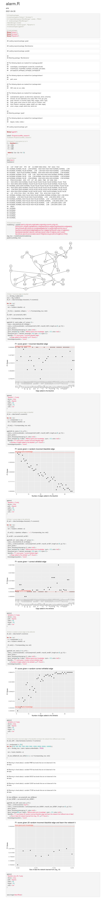

# CICS 490E Research Summary
**Evaluate effects of different kind of prior knowledge in causal structure learning from data**

Gary Wei (guanghaowei@umass.edu), Jinrui(Sherry) Zhou (jinruizhou@umass.edu)

***Mentor:*** Purva Pruthi(ppruthi@umass.edu)

## Project description
Basically, we examined on how the prior knowledge affect the result of learning causal structure from a given dataset. In specific, we add incorrect edges to the blacklist and white list as prior knowledge and examine the result of the learned network from different size of generated data.

> We will perform experiments to understand the relationship between informativeness of the prior and dataset sample size. From the survey of the previous works, one consistent finding was that if prior beliefs are closer to the true model, then they improve the learning process but if priors are misleading or incorrect, they harm the learning process [1]. We want to further understand this phenomenon by doing various experiments which systematically vary dataset size and prior correctness. We will also focus on understanding the relationship between how complicated the prior is (expressiveness of prior e.g. edge orientation vs path) and learning accuracy.

> - Vary the correctness of the prior provided by the user of the algorithm and run algorithm for fixed dataset size. This can be done by providing arguments to the structure learning algorithm in the form of blacklists and whitelists. For more information, check these examples.
> - Vary the size of the dataset and keep the correctness of the prior fixed. 

## Hypothesis
* The quantity of correct and incorrect prior information affects the results of learned network proportionally.
* The size of data where the network was learned from doesn't affect much to the result.

## Method
We use the [F1 score](https://en.wikipedia.org/wiki/F-score) as the scorer function to [compare the learned network with ground truth](https://www.bnlearn.com/examples/compare-dags/). It computes how many edged are different between the 2 networks.

## Process
1. We first train a networking from the alarm dataset using a hill-climbing (HC) algorithm, which is recommended by Purva saying that she has achieved best performance, as the learned network without any prior knowledge.
2. To see how incorrect prior knowledge affects the result, we firstly tried to add every ground truth edge into the blacklist and examine the result. The F1 score varies in a relatively small range, which should have something to do with the detail implementation of HC algorithm, otherwise the F1 score is expected to be similar.
3. Then we tried to choose n random incorrect edges into the blacklist, where n goes from 1 to the number of edges in the ground truth network. The result shows, almost, as the number of incorrect edges increases, the F1 score decreases. 
4. To see how correct prior knowledge affects the result, we did repeat step 2 and 3 and add the edges to the white list.
5. At last, to see how the size of data affects the result, we generate new data from the original dataset and the ground truth model. And choose 20 incorrect random edges added to the blacklist.

## Conclusion
* The more incorrect prior knowledge given, the worse the result is.
* The more correct prior knowledge give, the better the result is.
* The size of data where the network learned from doesn't have much to do with the result.

## Codes and Results

