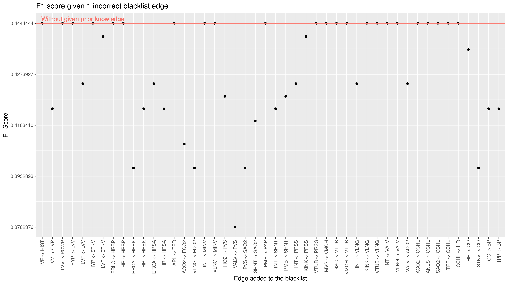

# Evaluate effects of different kind of prior knowledge in causal structure learning from data
***Mentor:*** Purva Pruthi(ppruthi@umass.edu)

Gary Wei (guanghaowei@umass.edu), Jinrui(Sherry) Zhou (jinruizhou@umass.edu)

## The proposed project
Basically, we are going to examine on how the prior knowledge affect the result of learning causal structure from a given dataset. In specific, we add incorrect edges to the blacklist and white list as prior knowledge and examine the result.

> We will perform experiments to understand the relationship between informativeness of the prior and dataset sample size. From the survey of the previous works, one consistent finding was that if prior beliefs are closer to the true model, then they improve the learning process but if priors are misleading or incorrect, they harm the learning process [1]. We want to further understand this phenomenon by doing various experiments which systematically vary dataset size and prior correctness. We will also focus on understanding the relationship between how complicated the prior is (expressiveness of prior e.g. edge orientation vs path) and learning accuracy.

> - Vary the correctness of the prior provided by the user of the algorithm and run algorithm for fixed dataset size. This can be done by providing arguments to the structure learning algorithm in the form of blacklists and whitelists. For more information, check these examples.
> - Vary the size of the dataset and keep the correctness of the prior fixed. 

## Dataset
We use the [*alarm*](https://www.bnlearn.com/documentation/man/alarm.html) Dataset.

## The ground truth Causal Structure

## Learn a causal structure
We use the [F1 score](https://en.wikipedia.org/wiki/F-score) as the scorer function to [compare the learned network with ground truth](https://www.bnlearn.com/examples/compare-dags/). 

## Figures

